# Modul_1-Jarkom

Name: Makna Alam Pratama  
NRP: 5025241077 

## Preblem 1
### How many pockets are recorded in pcapng file?
Answer: 9596  
- Look at the footer information where the packets number of the pcapng file shown  
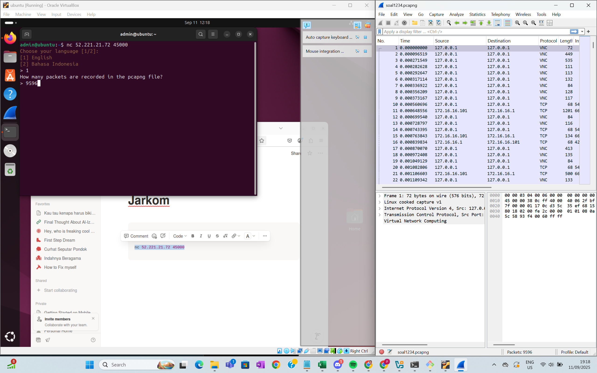 
### How many types of protocol (totals) are recorded in the traffic?
Answer: 12  
- Statictic menu --> protocol hierarchy --> count each row  
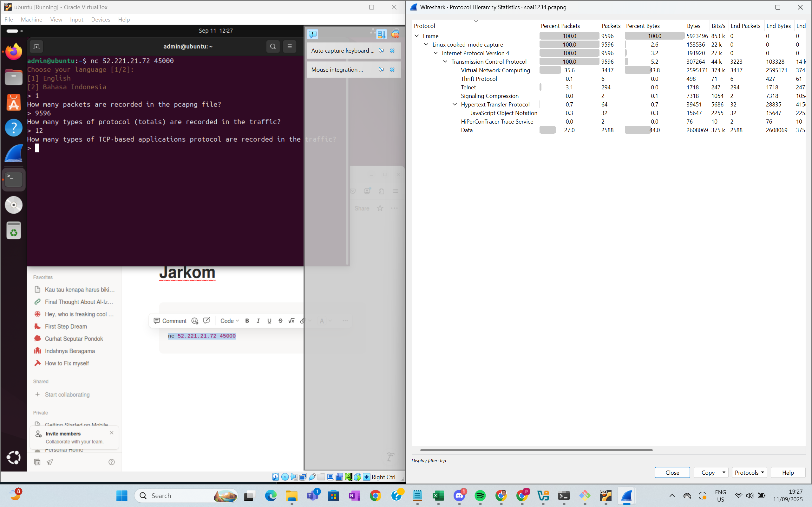 
### How many types ofTCP-based applications protocol are recorded in the traffic?
Answer: 8  
- Statictic menu --> protocol hierarchy --> count each row after Transmission Control Protocol  
 
### How many packets with pure TCP protocol are recorded in the traffic (without data)?
Answer: 3223  
- in filter, type: "tcp.len == 0" (the length of the TCP segment payload that carrys 0 data), which display 3222 packets. In some condition, Wireshark have minor problem by simply excluding 1 packets of data displayed in the number.
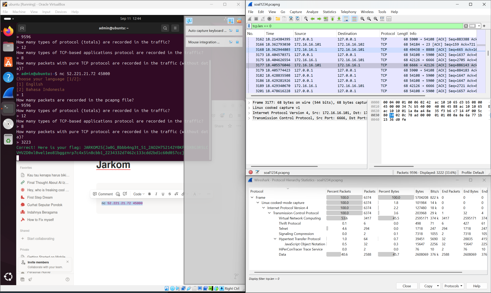 

## Preblem 3
### In what port is the telnet client open?
Answer: 54184  
- click any of the packets that has telnet protocol and in the info it says byte of data (which mean rechieve data), then look up the Transmission Control Protocol of that packet to find its port  
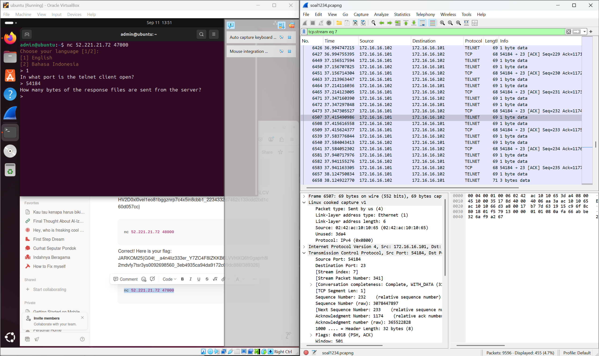 
### How many bytes of the response files are sent from the server?
Answer: 1449  
- right click the choosen port for number 3.1 --> click follow --> TCP stream --> look at the dropdown of entire conversation, there you will see the bytes it sends  
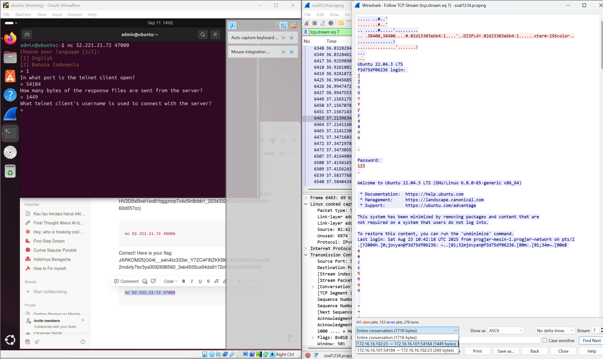 
### What telnet client's username is used to connect with the server?
Answer: joyvan  
- Still in the same TCP stream as number 3.2, try to find a word after "login:"  
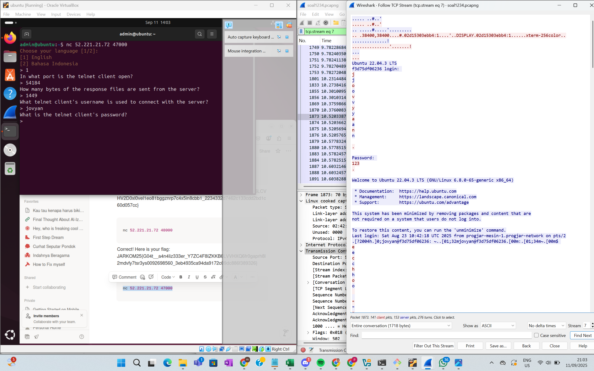 
### What is the telnet client's password?
Answer: 123  
- Still in the same TCP stream as number 3.2, try to find a word after "password:"  
 

## Preblem 4
### What is the first command that the client wrote on telnet connection?
Answer: echo  
- Still in the same TCP stream as number 3.2, try to find any command word in programming  
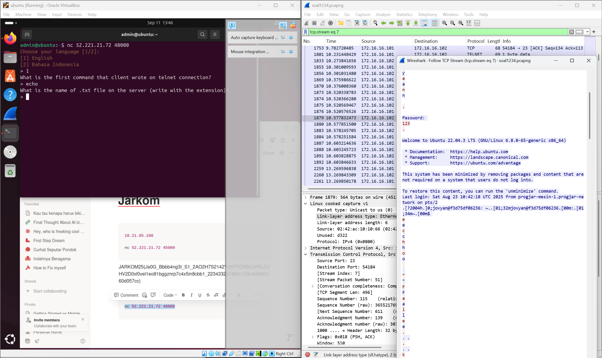 
### What is the name of .txt file on the server?
Answer: test.txt  
- Still in the same TCP stream as number 3.2, try to find any .txt written  
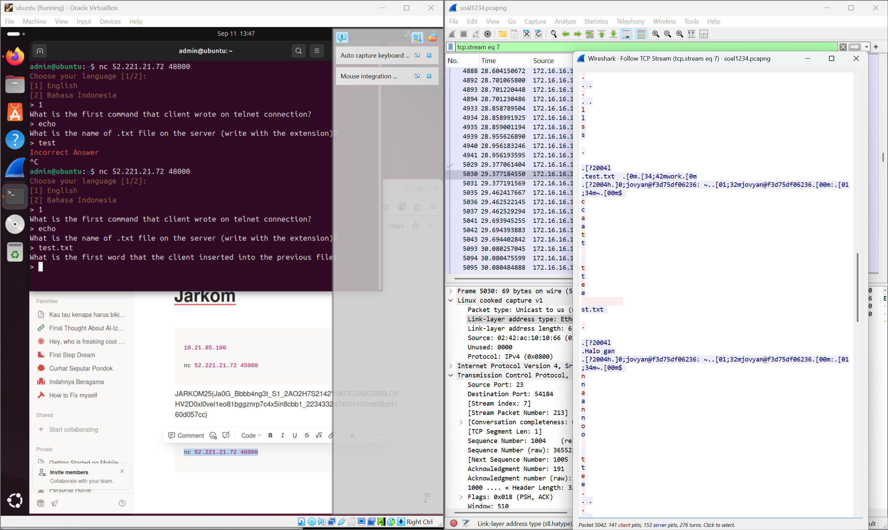 
### What is the first word that the client inserted into the previous file?
Answer: Jarkom  
- Still in the same TCP stream as number 3.2, try to find a word after "echo"  
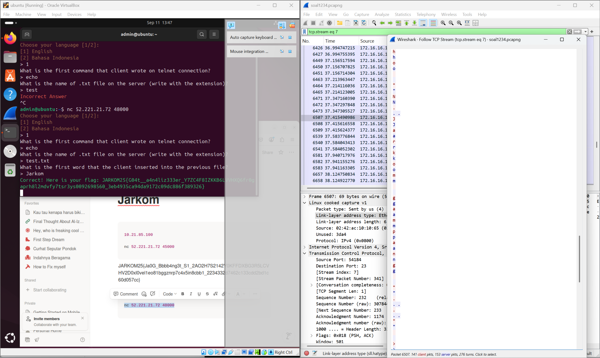 

## Preblem 5
### How many HTTP packets are recorded in the pcapng file?
Answer: 298  
- in filter, type: "http", then see the displayed packets  
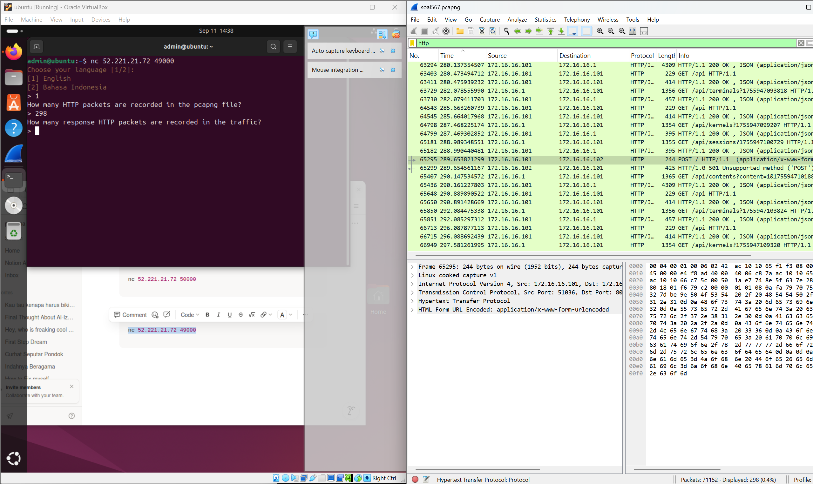 
### How many response HTTP packets are recorded in the traffic?
Answer:149  
- in filter, type: "http.response", then see the displayed packets  
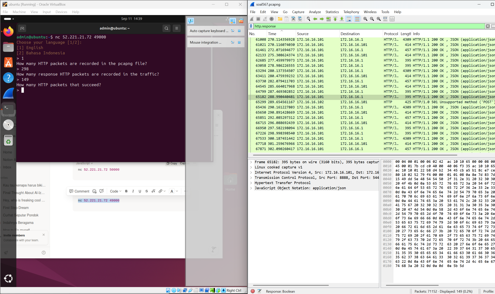 
### How many HTTP packets that succeed?
Answer: 296  
- in filter, type: "http", then see the displayed packets. In here, we must also count the packets that labeled with color black and red which we don't want to count them.  
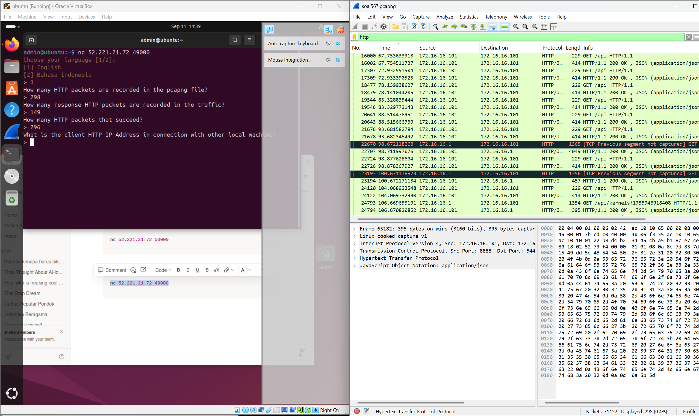 
### What is the client HTTP address in the connection with other local machine?
Answer: 172.16.16.101  
- click any HTTP packets that has the usual client protocol use in the info, like "GET" --> Go to Internet Protocol Version to find the address   
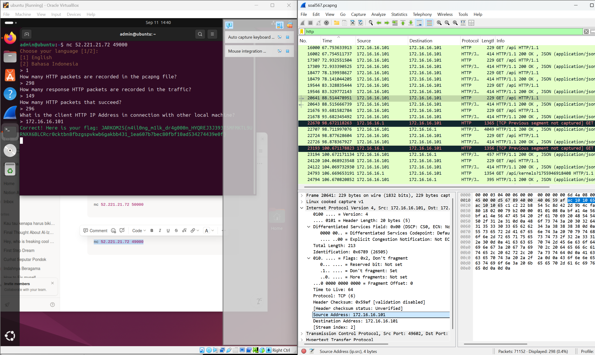 

## Preblem 7
### What is the image that is being requested by the client?
Answer: donalbebek.jpg  
- click File menu --> go to export object --> choose http --> search for any extention for image which jpg is one of them  
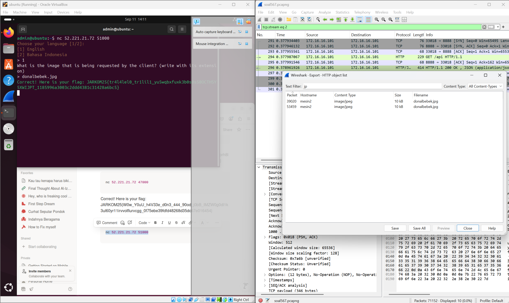 

## Preblem 8
### How many FTP packets are recorded in the pcapng file?
Answer: 81  
- in filter, type: "ftp or ftp-data", then see the displayed packets  
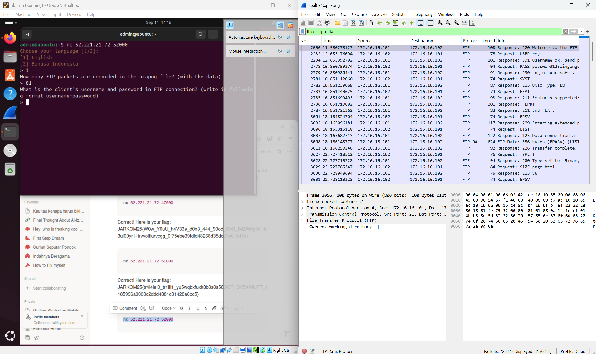 
### What is the client's username and password in the FTP connection?
Answer: rey:password123lingangu  
- after the filter in 8.1, choose any of the packets --> click follow --> TCP stream --> find keyword like "user" and "pass"  
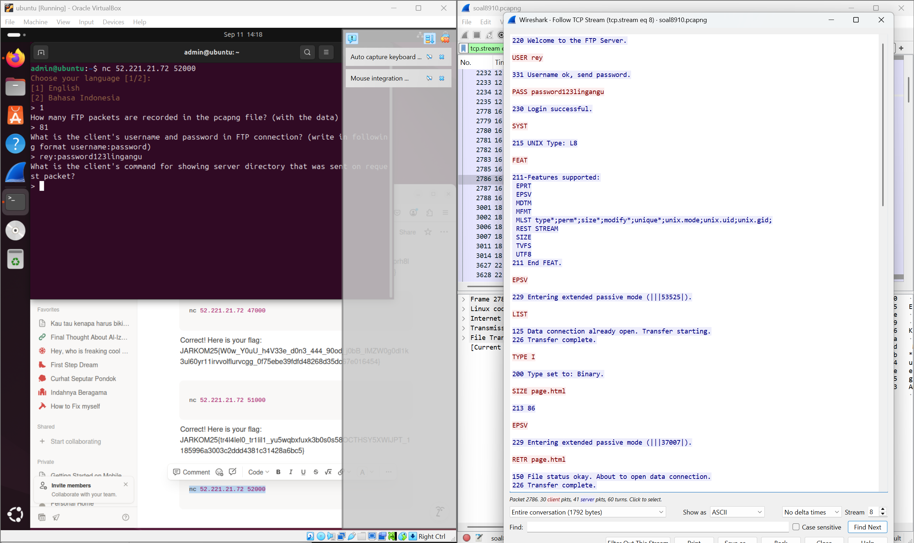 
### What is the client's command for showing server directory that was sent on request packet?
Answer: LIST  
- Still in the same TCP stream as 8.2, find any information that provide "transfer" word in it, since it is a sent request. And for the word that come before it should be the command behind it  
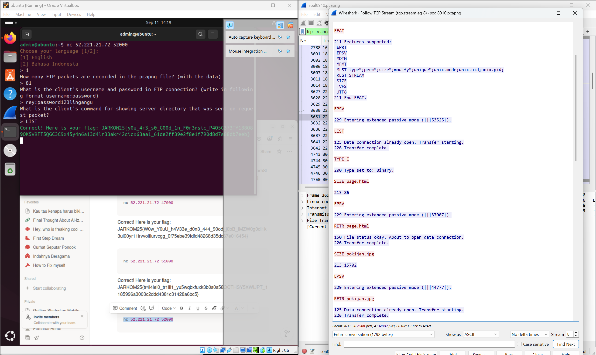 

